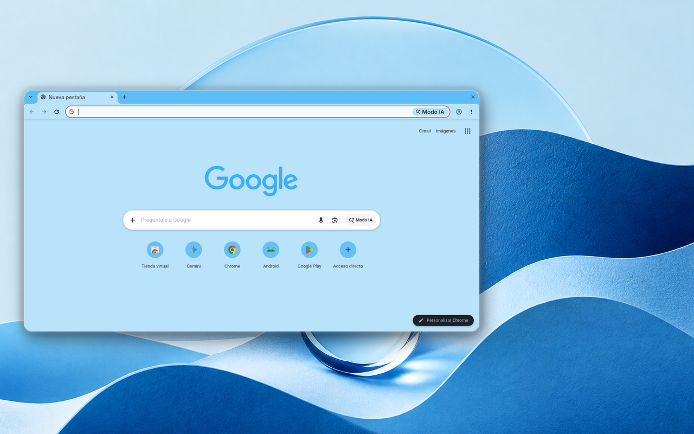

# Minimalist Oceans 🌊

A minimal Chrome theme in a clean, ocean-blue palette, by Miguel Euraque.

A bright sky-blue frame, a pale blue toolbar and new tab page, and cool gray text. It brings a clean, ocean-toned blue to the browser without going deep or dark.

## Features

- **Palette:** sky-blue frame, pale blue surfaces, cool gray text
- **Minimalist design:** clean and uncluttered
- **Easy installation:** Chrome Manifest V3
- **Gentle on the eyes:** low-contrast colors that stay easy to read

## Installation

### Chrome Web Store (recommended)

1. Visit the [Minimalist Oceans](https://chromewebstore.google.com/detail/minimalist-oceans/fpgfjngfhjnfegnhjbjgiikinafapeej) page in the Chrome Web Store.
2. Click **Add to Chrome**.

### From source

1. Clone this repository.
2. Open `chrome://extensions` and turn on Developer mode.
3. Click **Load unpacked** and select the theme folder.
